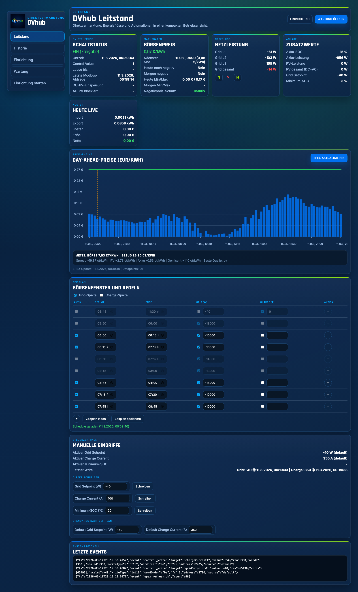
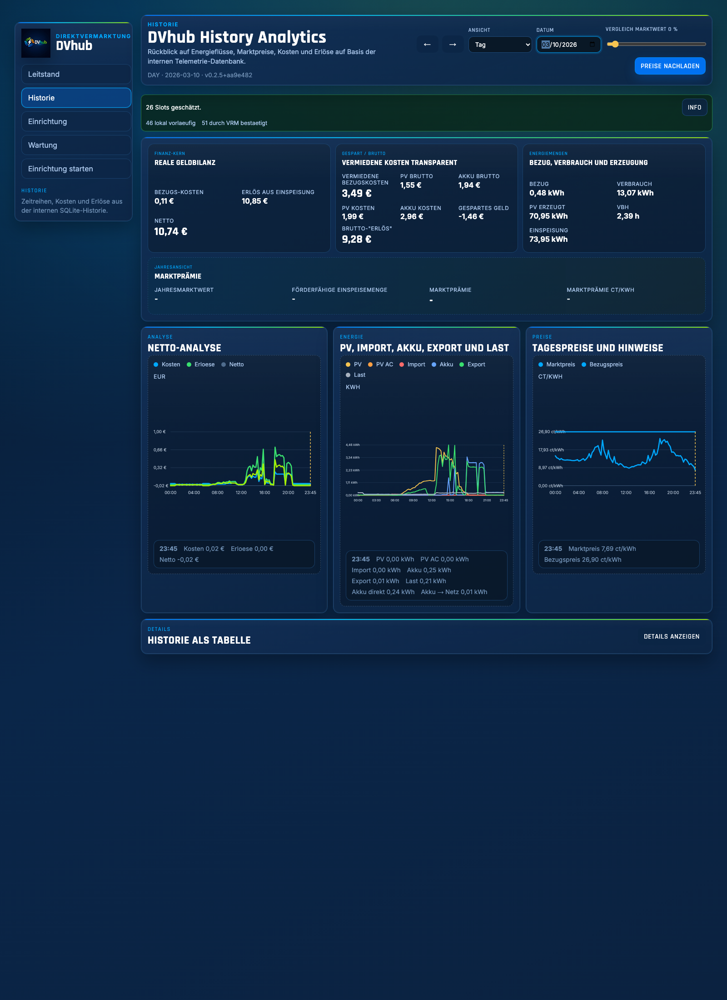
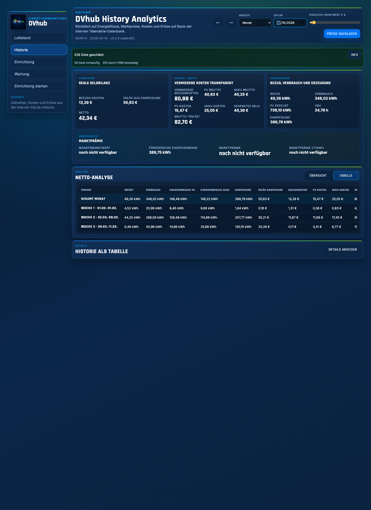
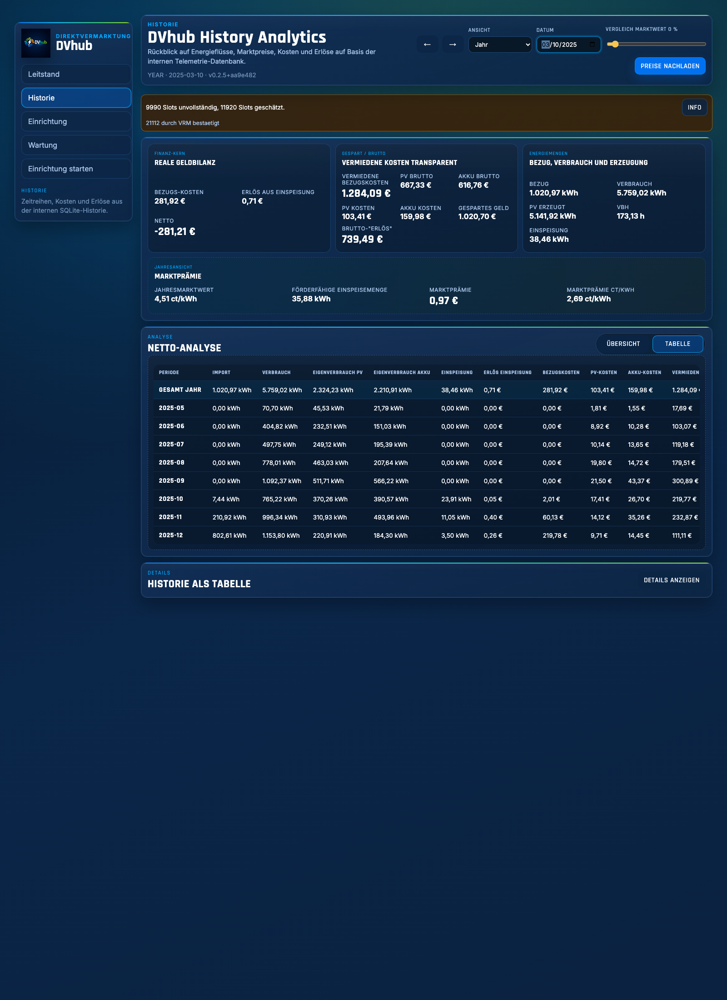

<p align="center">
  
</p>

```
██████╗ ██╗   ██╗██╗  ██╗██╗   ██╗██████╗
██╔══██╗██║   ██║██║  ██║██║   ██║██╔══██╗
██║  ██║██║   ██║███████║██║   ██║██████╔╝
██║  ██║╚██╗ ██╔╝██╔══██║██║   ██║██╔══██╗
██████╔╝ ╚████╔╝ ██║  ██║╚██████╔╝██████╔╝
╚═════╝   ╚═══╝  ╚═╝  ╚═╝ ╚═════╝ ╚═════╝
```

<p align="center">
  <strong>Hack the Grid</strong><br/>
  The unofficial DV interface — Direct Marketing Interface for Victron
</p>

> **Digitale Direktvermarktungsschnittstelle** auf Basis der PLEXLOG Modbus-Register,
> zugeschnitten auf Victron ESS-Systeme mit LUOX Energy (ehem. Lumenaza) als Direktvermarkter.

| | |
|---|---|
| **Status** | `main` -- Version 0.3.0 |
| **Getestet mit** | LUOX Energy, Victron Ekrano-GX, Fronius AC-PV |
| **Lizenz** | Energy Community License (ECL-1.0) |

<p align="center">
  <a href="assets/screenshots/dashboard-live-full-2026-03-11.png"></a>
  <a href="assets/screenshots/history-day-2026-03-10-full.png"></a>
</p>
<p align="center">
  <a href="assets/screenshots/history-month-2026-03-full.png"></a>
  <a href="assets/screenshots/history-year-2025-full.png"></a>
</p>

---

## Kurzüberblick

DVhub ersetzt bzw. ergänzt einen physischen Plexlog als DV-Schnittstelle. Die Modbus-Kommunikation
des Direktvermarkters wird in Software nachgebildet, während die Live-Daten direkt vom Victron-GX-System kommen.

DVhub auf `main` ist heute:

- **DV-Schnittstelle und Web-Leitstand** in einer Anwendung
- **Dashboard** für Live-Werte, Day-Ahead-Preise, Kosten und Steuerung
- **History-Seite** für Tag/Woche/Monat/Jahr direkt aus der SQLite-Telemetrie
- **Release 0.3.0 Schwerpunkt:** neue History-Analyse plus Backfill aus dem Victron VRM Portal
- **Setup-Assistent** für den ersten Start mit blockierender Validierung
- **Einstellungsoberfläche** statt roher `config.json`-Bearbeitung
- **Victron-Anbindung per Modbus TCP oder MQTT**
- **Telemetrie mit lokaler SQLite-Historie**, gezieltem Preis-Backfill und optionalem VRM-Nachimport
- **Integrationsplattform** für EOS, EMHASS, Home Assistant, Loxone und InfluxDB
- **Installierbare Service-Anwendung** mit `install.sh`, systemd und Health-/Restart-Funktionen

## Inhaltsverzeichnis

- [Schnellstart](#schnellstart)
- [Was DVhub kann](#was-dvhub-kann)
- [Oberflächen](#oberflächen)
- [Integrationen](#integrationen)
- [Direktvermarktung kompakt](#direktvermarktung-kompakt)
- [Installation im Detail](#installation-im-detail)
- [API und Konfiguration](#api-und-konfiguration)
- [Lizenz](#lizenz)

---

## Schnellstart

### Installer

```bash
curl -fsSL https://raw.githubusercontent.com/chloepriceless/dvhub/main/install.sh | sudo bash
```

Der Installer:

- installiert Node.js
- klont das Repo nach `/opt/dvhub`
- nutzt die App unter `/opt/dvhub/dvhub`
- migriert alte Installationen aus `/opt/dvhub/dv-control-webapp`
- richtet einen systemd-Service ein
- nutzt eine externe Config-Datei unter `/etc/dvhub/config.json`
- aktiviert Health-Checks und optionalen Restart aus der GUI
- legt die interne Telemetrie-Datenbank unter `/var/lib/dvhub/telemetry.sqlite` an
- startet `dvhub.service` nach dem Update automatisch neu

Wenn die Config-Datei noch fehlt oder ungültig ist, öffnet DVhub beim ersten Aufruf automatisch den Setup-Assistenten.

### Erster Aufruf

- Dashboard: `http://<host>:8080/`
- Historie: `http://<host>:8080/history.html`
- Einstellungen: `http://<host>:8080/settings.html`
- Setup: `http://<host>:8080/setup.html`
- Tools: `http://<host>:8080/tools.html`

---

## Was DVhub kann

### Kernfunktionen

- **DV-Modbus-Server** auf Standard-Port `1502` mit FC3/FC4 Read und FC6/FC16 Write
- **DV-Signalerkennung** inklusive Lease-Logik und sicherer Rückkehr in Freigabe
- **Victron-Steuerung** für Grid Setpoint, Charge Current und Min SOC
- **Negativpreis-Schutz** mit automatischer Reaktion auf EPEX-Preise
- **Day-Ahead-Preis-Engine** mit Heute-/Morgen-Daten, Hover-Details und Chart-Auswahl
- **Schedule-System** mit Defaults, manuellen Writes und Chart-zu-Schedule-Auswahl
- **Kosten- und Preislogik** für Netz, PV und Akku über `userEnergyPricing`
- **Datumsbasierte Bezugspreise** über `userEnergyPricing.periods`
- **Lokale Telemetrie** mit Persistenz, Rollups, historischem Nachimport und SQLite-basierter History-Analyse

### Betriebsmodell

- **Modbus TCP oder MQTT** als Victron-Transport
- **Externe Konfiguration** statt fest eingebauter Runtime-Dateien
- **systemd-ready** für dauerhaften Betrieb
- **Health-/Service-Status** direkt in Einstellungen und Tools

---

## Oberflächen

### Dashboard

Das Dashboard bündelt die laufenden Betriebsdaten:

- DV-Schaltstatus
- Börsenpreis mit Negativpreis-Schutz
- Netzleistung pro Phase
- Victron-Zusatzwerte wie SOC, Akku-Leistung und PV
- Kostenübersicht für den aktuellen Tag
- Day-Ahead-Chart mit Hover, Highlight und Schedule-Auswahl
- Steuerung mit aktiven Werten, Defaults und manuellen Writes
- letzte Events aus dem Systemlog

### Einstellungen

Die Einstellungsseite ist in kompakte Arbeitsbereiche gegliedert:

- Schnellstart
- Anlage verbinden
- Steuerung
- Preise & Daten
- Erweitert

Dazu kommen Import/Export, Health-Checks, Service-Status und optional ein Restart-Button.

### Setup

Der First-Run-Setup-Assistent führt Schritt für Schritt durch:

- HTTP-Port und API-Token
- Victron-Verbindung per Modbus oder MQTT
- Meter- und DV-Basiswerte
- EPEX- und Influx-Grunddaten
- Review-Schritt mit Validierung vor dem Speichern

### Tools

Die Tool-Seite enthält:

- Modbus Register Scan
- Schedule JSON Bearbeitung
- Health-/Service-Status
- VRM History-Import für Telemetrie-Nachfüllung

### Historie

Die History-Seite bündelt die interne SQLite-Historie zu einer eigenen Analyseansicht:

- Tag-, Wochen-, Monats- und Jahresansicht
- Bezug, Einspeisung, Kosten, Erlöse und Netto je Zeitraum
- Preisvergleich zwischen historischem Marktpreis und eigenem Bezugspreis
- Kennzeichnung unvollständiger Slots bei fehlenden Marktpreisen oder Tarifzeiträumen
- gezielter Preis-Backfill nur für Telemetrie-Buckets ohne historischen Marktpreis

---

## Integrationen

DVhub stellt Daten bereit oder nimmt Optimierungsergebnisse entgegen für:

- **Home Assistant**
- **Loxone**
- **EOS (Akkudoktor)**
- **EMHASS**
- **InfluxDB v2/v3**

Zusätzlich kann DVhub historische Daten per **VRM** nachladen, wenn neue Installationen ältere Werte auffüllen sollen oder Lücken entstanden sind.
Für Marktpreise kann DVhub zusätzlich fehlende historische Börsenpreise gezielt über Energy Charts in die interne SQLite-Datenbank zurückschreiben.

---

## Direktvermarktung kompakt

### Wozu eine DV-Schnittstelle?

Eine Direktvermarktungs-Schnittstelle verbindet den Direktvermarkter mit deiner Anlage, damit:

- Live-Werte abgefragt werden können
- Steuersignale bei negativen Preisen oder Vermarktungsvorgaben ankommen

Der Direktvermarkter kann so Einspeisung bewerten, regeln und wirtschaftlich steuern.

### Warum DVhub statt Plexlog?

Der physische Plexlog kann Live-Daten liefern, aber die Steuerung moderner Victron-Setups ist in der Praxis oft unflexibel oder nicht vollständig nutzbar. DVhub liest die Daten direkt vom GX-Gerät und beantwortet die PLEXLOG-kompatiblen Modbus-Anfragen in Software.

### Wer braucht das?

Nach dem Solarspitzengesetz benötigen PV-Anlagen ab **25 kWp** typischerweise eine DV-Schnittstelle für die Direktvermarktung. Kleinere Anlagen können freiwillig teilnehmen.

### Warum ist das auch unter 30 kWp interessant?

Mit der diskutierten **Pauschaloption / MiSpeL** wird Direktvermarktung auch für kleinere Anlagen mit Speicher attraktiver, weil Speicher flexibler aus PV und Netz geladen werden dürfen und die Vermarktung wirtschaftlich interessanter wird.

### MiSpeL-Status

Stand **März 2026**:

- BNetzA-Festlegung soll bis **30. Juni 2026** finalisiert werden
- die **EU-beihilferechtliche Genehmigung** steht noch aus
- die Konsultationsphase wurde im **Oktober 2025** abgeschlossen

### Offizielle Links

- [BNetzA MiSpeL Festlegungsverfahren](https://www.bundesnetzagentur.de/DE/Fachthemen/ElektrizitaetundGas/ErneuerbareEnergien/EEG_Aufsicht/MiSpeL/start.html)
- [BNetzA MiSpeL Artikel/Übersicht](https://www.bundesnetzagentur.de/DE/Fachthemen/ElektrizitaetundGas/ErneuerbareEnergien/EEG_Aufsicht/MiSpeL/artikel.html)
- [BNetzA Pressemitteilung (19.09.2025)](https://www.bundesnetzagentur.de/SharedDocs/Pressemitteilungen/DE/2025/20250919_MiSpeL.html)
- [Anlage 2: Pauschaloption Eckpunkte (PDF)](https://www.bundesnetzagentur.de/DE/Fachthemen/ElektrizitaetundGas/ErneuerbareEnergien/EEG_Aufsicht/MiSpeL/DL/Anlage2.pdf)
- [BMWK FAQ Solarspitzengesetz](https://www.bundeswirtschaftsministerium.de/Redaktion/DE/Dossier/ErneuerbareEnergien/faq-zur-energierechtsnovelle-zur-vermeidung-von-stromspitzen-und-zum-biomassepaket.html)

### LUOX-Anbindung

Für LUOX brauchst du in der Praxis:

1. Meldung, dass eine PLEXLOG-kompatible DV-Schnittstelle vorhanden ist
2. OpenVPN-Tunnel zu LUOX
3. Portforwarding von Port `502` aus dem Tunnel auf Port `1502` von DVhub

**Unifi-Hinweis:** Falls die GUI das Tunnel-Portforwarding nicht sauber abbildet, hilft das Skript [`20-dv-modbus.sh`](20-dv-modbus.sh) für die iptables-Regeln.

---

## Installation im Detail

### Manuelle Installation

```bash
sudo apt update
sudo apt install -y curl ca-certificates git
curl -fsSL https://deb.nodesource.com/setup_22.x | sudo -E bash -
sudo apt install -y nodejs
sudo apt install -y tcpdump jq
sudo mkdir -p /opt/dvhub /etc/dvhub /var/lib/dvhub
sudo useradd -r -s /usr/sbin/nologin dvhub
sudo git clone https://github.com/chloepriceless/dvhub.git /opt/dvhub
```

Danach:

```bash
sudo chown -R dvhub:dvhub /opt/dvhub /etc/dvhub /var/lib/dvhub
cd /opt/dvhub/dvhub
npm install --omit=dev
sudo cp config.example.json /etc/dvhub/config.json
sudo nano /etc/dvhub/config.json
```

Nur bei MQTT-Nutzung zusätzlich:

```bash
npm install mqtt
```

### systemd Service

Datei: `/etc/systemd/system/dvhub.service`

```ini
[Unit]
Description=DVhub DV Control
After=network-online.target
Wants=network-online.target

[Service]
Type=simple
User=dvhub
Group=dvhub
WorkingDirectory=/opt/dvhub/dvhub
ExecStart=/usr/bin/node --experimental-sqlite /opt/dvhub/dvhub/server.js
Environment=NODE_ENV=production
Environment=DV_APP_CONFIG=/etc/dvhub/config.json
Environment=DV_ENABLE_SERVICE_ACTIONS=1
Environment=DV_SERVICE_NAME=dvhub.service
Environment=DV_SERVICE_USE_SUDO=1
Environment=DV_DATA_DIR=/var/lib/dvhub
Restart=always
RestartSec=3

[Install]
WantedBy=multi-user.target
```

Service aktivieren:

```bash
sudo systemctl daemon-reload
sudo systemctl enable --now dvhub
```

### Restart aus der GUI erlauben

```bash
SYSTEMCTL_PATH="$(command -v systemctl)"
echo "dvhub ALL=(root) NOPASSWD: ${SYSTEMCTL_PATH} restart dvhub.service" | sudo tee /etc/sudoers.d/dvhub-service-actions >/dev/null
echo "dvhub ALL=(root) NOPASSWD: ${SYSTEMCTL_PATH} is-active dvhub.service" | sudo tee -a /etc/sudoers.d/dvhub-service-actions >/dev/null
echo "dvhub ALL=(root) NOPASSWD: ${SYSTEMCTL_PATH} show dvhub.service *" | sudo tee -a /etc/sudoers.d/dvhub-service-actions >/dev/null
sudo chmod 440 /etc/sudoers.d/dvhub-service-actions
```

### Manueller Start

```bash
cd /opt/dvhub/dvhub
DV_APP_CONFIG=/etc/dvhub/config.json DV_DATA_DIR=/var/lib/dvhub npm start
```

---

## API und Konfiguration

### History API

- `GET /api/history/summary?view=day|week|month|year&date=YYYY-MM-DD`
- `POST /api/history/backfill/prices`
- `GET /api/history/import/status`
- `POST /api/history/import`
- `POST /api/history/backfill/vrm`

`/api/history/import` startet einen konfigurierten oder expliziten Importlauf.
`/api/history/backfill/vrm` nutzt die in `telemetry.historyImport` hinterlegte VRM-Quelle fuer Gap- oder Full-Backfills.

### Bezugspreise nach Zeitraum

Unter `userEnergyPricing.periods` lassen sich mehrere Tarifzeiträume definieren:

- Zeiträume sind tageweise und inklusive `startDate` bis `endDate`
- Zeiträume dürfen sich nicht überschneiden
- pro Zeitraum ist `fixed` oder `dynamic` möglich
- wenn kein Zeitraum passt, greift die bestehende Legacy-Preislogik als Fallback

### Marktwert- und Marktprämien-Modus

Unter `userEnergyPricing` stehen fuer die History-Marktprämie zwei zusätzliche Felder bereit:

- `marketValueMode`: `annual` fuer das bisherige Verhalten oder `monthly` fuer Monatsmarktwerte auch in Monats- und Jahresansichten
- `pvPlants`: Liste der PV-Anlagen mit `kwp` und `commissionedAt`, damit die offiziellen anzulegenden Referenzwerte pro Anlage abgeleitet werden koennen

Die Einstellungsseite pflegt diese Werte zentral im Bereich Marktprämie.

### Wichtige API-Endpunkte

| Methode | Pfad | Beschreibung |
|---------|------|--------------|
| `GET` | `/dv/control-value` | DV Status: `0` = Abregelung, `1` = Einspeisung erlaubt |
| `GET` | `/api/status` | Vollständiger Systemstatus |
| `GET` | `/api/costs` | Tages-Kostenübersicht |
| `GET` | `/api/log` | Letzte 300 Event-Log Einträge |
| `POST` | `/api/epex/refresh` | EPEX-Preise manuell aktualisieren |
| `GET` | `/api/meter/scan` | Scan-Ergebnisse abrufen |
| `POST` | `/api/meter/scan` | Modbus Register-Scan starten |
| `GET` | `/api/history/import/status` | Status des konfigurierten History-Imports |
| `POST` | `/api/history/import` | Historische Telemetrie-Daten importieren |
| `GET` | `/api/schedule` | Aktuelle Schedule-Regeln und Config |
| `POST` | `/api/schedule/rules` | Schedule-Regeln aktualisieren |
| `POST` | `/api/schedule/config` | Default-Werte aktualisieren |
| `POST` | `/api/control/write` | Manueller Write |
| `POST` | `/api/admin/service/restart` | systemd-Service über die GUI neu starten |
| `GET` | `/api/integration/home-assistant` | Home Assistant JSON |
| `GET` | `/api/integration/loxone` | Loxone Textformat |
| `GET` | `/api/integration/eos` | EOS Messwerte + EPEX-Preise |
| `POST` | `/api/integration/eos/apply` | EOS Optimierung anwenden |
| `GET` | `/api/integration/emhass` | EMHASS Messwerte + Preisarrays |
| `POST` | `/api/integration/emhass/apply` | EMHASS Optimierung anwenden |
| `GET` | `/api/keepalive/modbus` | Letzte Modbus-Abfrage |
| `GET` | `/api/keepalive/pulse` | 60s Uptime-Pulse |

### Wichtige Config-Sektionen

| Sektion | Beschreibung |
|---------|--------------|
| `victron` | GX-Verbindung via Host, Port, Unit-ID, Transport, MQTT |
| `meter` | Grid-Meter Register |
| `points` | Lesepunkte für SOC, Batterie, PV und weitere Werte |
| `controlWrite` | Schreibbare Register |
| `dvControl` | DV-Steuerung und Negativpreis-Schutz |
| `schedule` | Zeitplan-Regeln und Defaults |
| `epex` | Preiszone und Zeitzone |
| `influx` | InfluxDB-Anbindung |
| `telemetry` | Lokale SQLite-Historie, Rollups, Preis-Backfill und VRM-History-Import |
| `userEnergyPricing` | Eigene Preislogik für Netz, PV und Akku plus Marktwert-/PV-Anlagen-Metadaten |
| `scan` | Modbus Scan-Parameter |

### Hinweise

- `controlWrite.<target>.writeType` kann `int16`, `uint16`, `int32` oder `uint32` sein
- für ESS Mode 2/3 wird Grid-Setpoint über `unitId 100`, `address 2700`, `fc 16`, `writeType int16` empfohlen
- Legacy-Fallback für Grid-Setpoint bleibt mit `fc 6` auf `address 2700` möglich
- **InfluxDB v3** ist Default, v2 bleibt kompatibel
- `dvControl.enabled` ist standardmäßig deaktiviert und muss aktiv gesetzt werden
- `userEnergyPricing` erlaubt festen Endkundenpreis oder dynamische Preisbestandteile auf Basis von EPEX
- im MQTT-Modus wird `victron.mqtt.portalId` benötigt; ohne eigenen Broker nutzt DVhub den GX-Host
- `npm install mqtt` wird nur für MQTT-Betrieb benötigt

---

## Lizenz

This project is licensed under the **Energy Community License (ECL-1.0)**.

The goal of this license is to support the renewable energy community
while preventing commercial reselling of the software.

### Allowed

* Operating energy systems using this software
* Generating revenue from energy production
* Hiring companies for installation or administration
* Community modifications and forks

### Not allowed

* Selling the software itself
* Selling hardware with the software preinstalled
* Commercial SaaS offerings based on this software
* Bundling the software into commercial products

If your company wants to integrate this software into a commercial
product, please request a **commercial license**.
